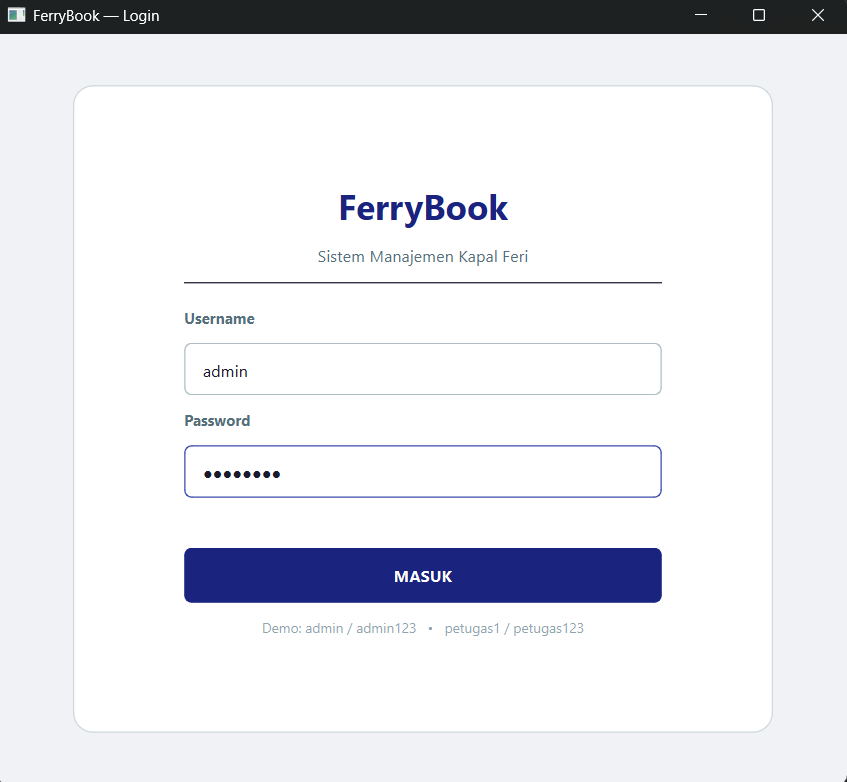
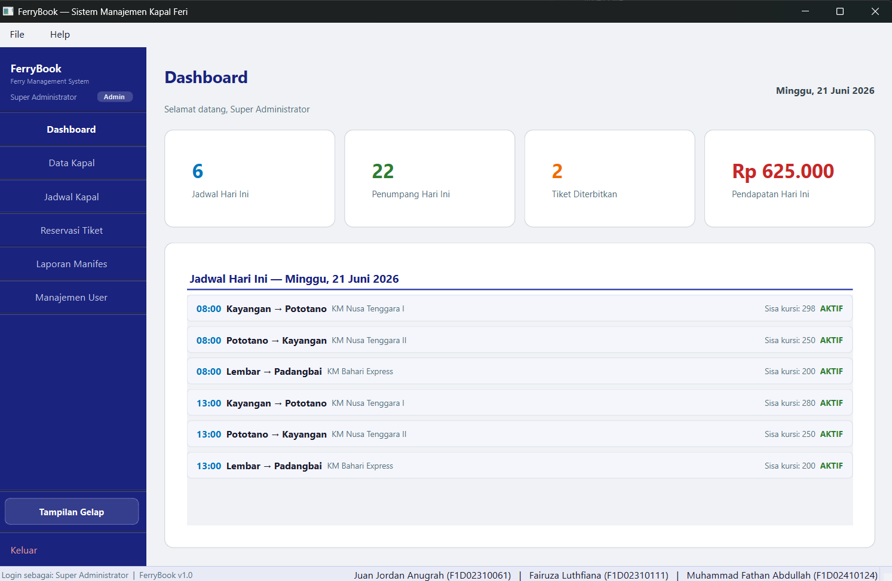
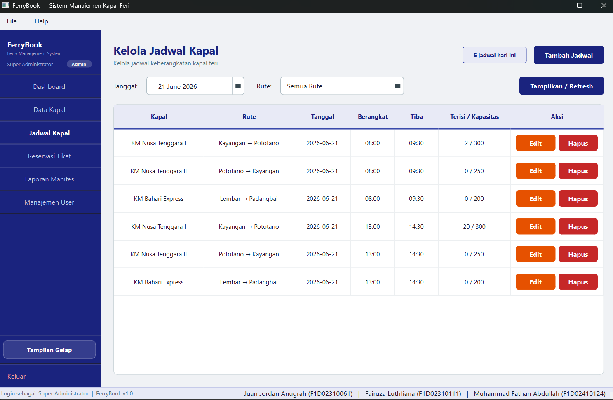
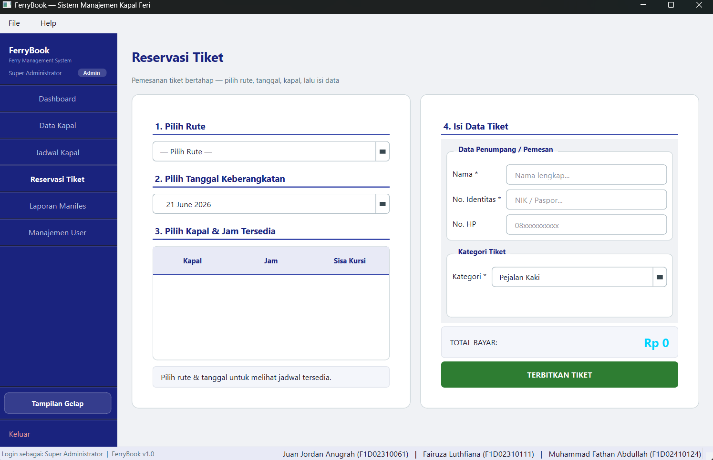
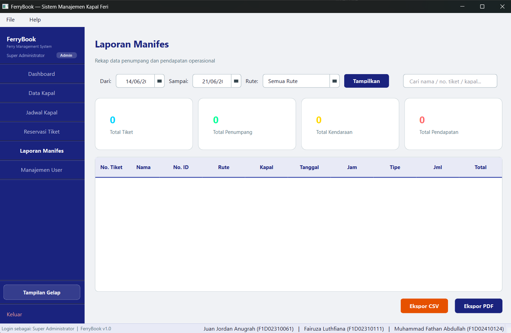
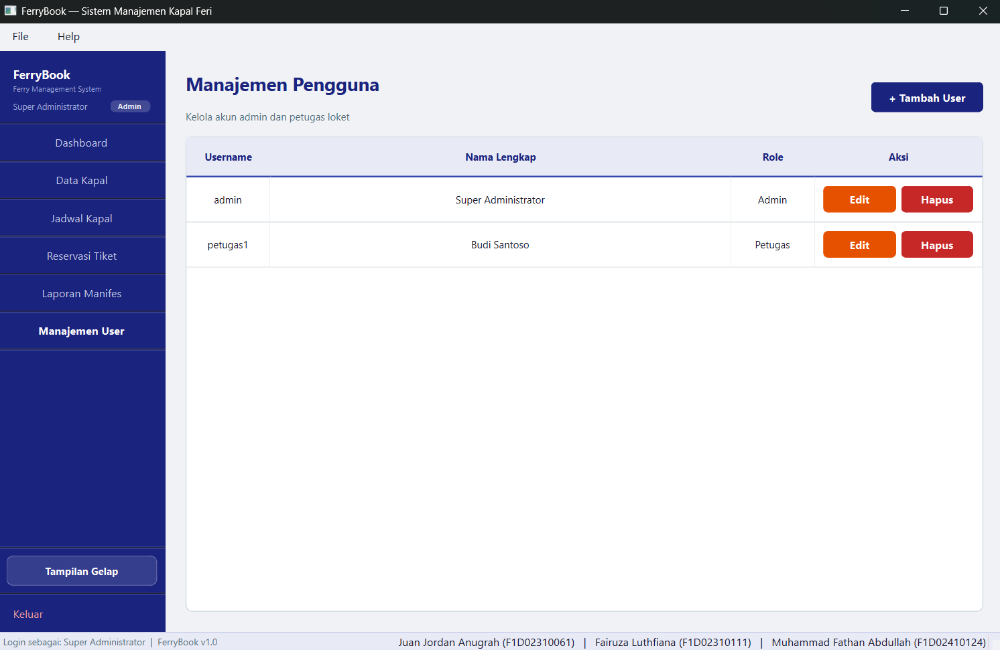

# FerryBook — Sistem Manajemen Jadwal & Reservasi Tiket Kapal Feri

Aplikasi desktop (GUI) berbasis **PySide6** untuk mengelola jadwal keberangkatan
kapal feri dan penerbitan tiket. Dibuat sebagai Proyek Akhir mata kuliah
**Pemrograman Visual**.

## Deskripsi Singkat

FerryBook membantu petugas pelabuhan mengelola data armada kapal, jadwal
keberangkatan, serta menerbitkan dan mencetak tiket. Aplikasi memiliki dua peran
pengguna (Admin & Petugas Loket), dashboard ringkasan, laporan manifes yang dapat
diekspor ke CSV/PDF, serta dukungan tema gelap/terang.

## Anggota Kelompok

| Nama | NIM |
|------|-----|
| Juan Jordan Anugrah | F1D02310061 |
| Fairuza Luthfiana | F1D02310111 |
| Muhammad Fathan Abdullah | F1D02410124 |

## Fitur Utama

- **Multi-peran**: Admin (kelola kapal, jadwal, user, laporan) dan Petugas Loket
  (reservasi & laporan).
- **Dashboard**: ringkasan KPI hari ini + daftar jadwal hari ini.
- **Manajemen data (CRUD)**: Kapal, Jadwal, dan User.
- **Reservasi bertahap**: pilih Rute → Tanggal → Kapal & Jam → isi data tiket.
- **Kapasitas kursi** dengan validasi anti-overbooking; jam tiba & harga otomatis.
- **Laporan Manifes**: filter tanggal/rute, pencarian, sorting, ekspor **CSV & PDF**.
- **Tema gelap/terang**, Menu Bar (File/Help), dan Status Bar identitas kelompok.

## Struktur Folder

```
pv26-finalproject-ferrybook/
├── main.py            # entry point aplikasi
├── main_window.py     # jendela utama + sidebar + menu/status bar
├── requirements.txt
├── assets/            # screenshot & gambar
├── database/          # koneksi & skema SQLite
├── models/            # query/logika data
├── utils/             # tema & helper PDF
└── views/             # seluruh halaman GUI
```

## Cara Menjalankan

1. (Opsional) buat virtual environment:
   ```bash
   python -m venv venv
   venv\Scripts\activate        # Windows
   source venv/bin/activate     # Linux/Mac
   ```
2. Pasang dependensi:
   ```bash
   pip install -r requirements.txt
   ```
3. Jalankan aplikasi:
   ```bash
   python main.py
   ```

Database SQLite beserta data awal dibuat otomatis saat pertama dijalankan.

### Akun Demo

| Peran | Username | Password |
|-------|----------|----------|
| Admin | `admin` | `admin123` |
| Petugas Loket | `petugas1` | `petugas123` |

## Screenshot

**Halaman Login**



**Dashboard**



**Kelola Jadwal Kapal**



**Reservasi Tiket**



**Laporan Manifes**



**Manajemen User**



## Pembagian Tugas

### Anggota 1 — Fathan (Muhammad Fathan Abdullah)
**Fokus: Reservasi & Ticketing**
File: `views/reservasi_view.py`, `utils/pdf_utils.py`
Tugas:
- Form reservasi tiket bertahap
- Validasi & update kapasitas kapal
- Cetak tiket & ekspor PDF

### Anggota 2 — Juan (Juan Jordan Anugrah)
**Fokus: Master Data & Jadwal**
File: `views/kapal_view.py`, `views/jadwal_view.py`, `database/schema.py`, `models/models.py`
Tugas:
- CRUD kapal & jadwal
- Struktur database SQLite
- Relasi antar tabel

### Anggota 3 — Fiana (Fairuza Luthfiana)
**Fokus: Authentication & Dashboard**
File: `views/login_view.py`, `views/dashboard_view.py`, `views/user_view.py`, `main.py`, `main_window.py`, `utils/theme_manager.py`
Tugas:
- Login & manajemen sesi
- Dashboard & laporan manifes
- Navigasi sidebar/menu, styling & tema

## Teknologi

- Python 3 + **PySide6**
- SQLite (modul `sqlite3` bawaan Python)
- **ReportLab** untuk ekspor PDF
